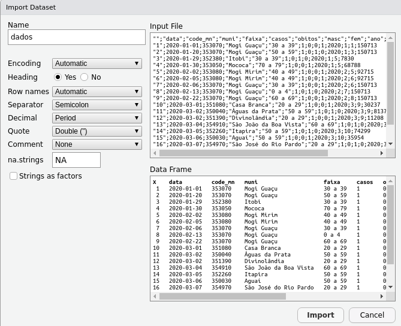

---
output:
  pdf_document: default
  html_document: default
---
```{r setup, include=FALSE}
knitr::opts_chunk$set(echo = TRUE, message = FALSE, warning = FALSE)
```

# Leitura de arquivos de texto

## Diretório de trabalho  

Abaixo são transcritos alguns comandos e métodos para se definir e conhecer o diretório de trabalho, bem como manipular criação e exclusão de pastas e arquivos.  

Comando | Definição
--------|----------
setwd() | Define diretório de trabalho.
getwd() | Identifica diretório ativo.
dir() | Retorna todo o conteúdo do diretório ativo.   
Ctrl + Shift + h | Abre janela de navegação para definir diretório.
file.choose() | Abre janela de navegação e ao selecionar o arquivo, ele retorna o caminho (diretório). Pode-se usar também dentro do comando, como em read.csv2(file = file.choose()).
No RStudio: Ir em Session,  Setting Working Directory | Equivalente a Ctrl + Shift + h
Inserir aspas ' ' + Tab entre elas | Navegação que pode servir para explorar caminhos.
dir.create() | Cria uma pasta de trabalho.
unlink() | Deleta uma pasta, ex. unlink("some_directory", recursive = TRUE).
file.create() | Cria um arquivo no diretório ex. file.create("text_file.txt") (docx, csv, etc).
file.copy() | Copia um arquivo. Ex. file.copy(from = "source_file.txt", to = "destination_folder").
file.remove() | Deleta um arquivo, ex. file.remove("csv_file.csv"). Pode-se usar também unlink('csv_file.csv').
list.files() | Lista os arquivos presentes no diretório.

<Br>

**Exemplo - list.files()**

```{r list.files}
list.files(path = 'dados/',      # Caminho do arquivo
           pattern = '.ods',     # Formato especificado
           full.names = FALSE,   # Somente nome
           recursive = TRUE,     # Pesquisa em subpastas
           ignore.case = FALSE)  # Ignora tamanhos das letras
```

<Br>

## Leitura de arquivos  

### utils::read.csv2()

read.csv = Arquivos separados por vírgula.  
read.csv2 = Arquivos separados por ponto e vírgula.

Os argumentos das funções são os mesmos, por isso o exemplo será dado somente para .csv2 (mais usado)

```{r .csv2}
dados <- read.csv2(file = 'dados/dados.csv')
head(dados, 5)          # Exibir as 5 primeiras linhas dos dados.
```

<Br>

**Argumentos principais**

Os argumentos são os mesmos da função read.table().

Argumento | Definição
----------|----------
file | Nome do arquivo que será lido, contendo o caminho do diretório.
header | Logical. Indica se o arquivo contém os nomes das colunas na primeira linha.
sep | Tipo de separador de campo. Default é = ";".
dec | Tipo de separador de decimal. Default é = ".".
nrows | Integer. Número máximo de linhas a serem lidas.
skip | Integer. Número de linhas que serão puladas antes de iniciar a leitura dos dados.
fill | Logical. Se TRUE, caso as linhas tenham comprimento desigual, seão adicionados campos em branco.
blank.lines.skip | Logical. Se TRUE linhas vazias serão ignoradas.
stringsAsFactors | Logical. Se TRUE os vetores character serão convertidos para factors. Se houver distorção dos caracteres, utilizar FALSE para sem conversão.
fileEncoding | Character string. Define o encoding que será usado. Ex. fileEnconding = "UTF-8" ou "Latin-1" ou "ISO-8859-1".
skipNull | Logical. Se TRUE os nulos (NA) devem ser ignorados.
colClasses | character. Um vetor de classes referentes as colunas. Valores possíveis são NA (default, quando type.convert é usado), "NULL" (quando a coluna é pulada), um vetor atomico de classes(logical, integer, numeric, complex, character, raw), or "factor", "Date" or "POSIXct".

<Br>

### readr::read_csv2()

**Exemplo 1**

```{r exemplo1_csv2}
dados <- readr::read_csv2(file = 'dados/dados.csv',  # Caminho e arquivo
                          col_select = c(2,4:7),     # Seleção de colunas
                          guess_max = 1000,          # Máximo de linhas utilizadas para adivinhar classes
                          skip_empty_rows = TRUE)    # Pular linhas vazias
head(dados, 5)                                       
```

<Br>

**Exemplo 2**

```{r exemplo2_csv2}
dados <- readr::read_csv2(
              file = 'dados/dados.csv',   # Caminho e arquivo
              guess_max = 1000,           # Linhas utilizadas para classes
              skip_empty_rows = TRUE,     # Pular linhas vazias
              skip = 1,                   # Pular primeira linha
              col_names = c('a','b','c','d','e'),   # Definir nomes das colunas
              col_select = c('a','b','c','d','e'))  # Selecionar colunas
head(dados, 5)
```

<Br>

**Argumentos principais**

Argumento | Definição
----------|----------
file | Nome do arquivo que será lido, contendo o caminho do diretório (admite http). Arquivos terminados em .gz, .bz2, .xz, ou .zip serão automaticamente descomprimidos.
col_names | TRUE ou FALSE ou um vetor tipo caracter com nomes das colunas. Se TRUE, a primeira linha será usada para nomear as colunas. Se FALSE, nomes das colunas serão gerados automaticamente (X1, X2, X3 etc). Se col_names for um vetor com nomes, os valores serão usados como nomes das colunas, mas a primeira linha será considerada no banco (nomes errados), assim, pode-se usar o argumento renomeando as colunas, mas fazendo a leitura sem considerar a primeira linha, com [-1,] ou skip = 1. Colunas sem nome (NA) receberão nomes fictícios.
col_types | Se for NULL, todos as classes de coluna serão imputadas a partir do máximo de linhas lidas (guess_max) intercaladas por todo o arquivo. Se a imputação falhar, você precisará aumentar o guess_max ou fornecer os tipos corretos você mesmo. As especificações de coluna criadas por list() ou cols() devem conter uma especificação de coluna para cada coluna. Se você quiser ler apenas um subconjunto das colunas, use cols_only(). Para compactar um vetor com as classes, usar as letras c = character, i = integer, n = number, d = double, l = logical, f = factor, D = date, T = date time, t = time, ? = guess. Por padrão, a definição de classe é automática.
col_select | Colunas a serem incluídas nos resultados, equivale a dplyr::select() para se referir às colunas pelo nome. Use c() ou list() para usar mais de uma expressão de seleção. Embora esse uso seja menos comum, col_select também aceita um índice de coluna numérica.
locale | A localidade controla os padrões que variam de lugar para lugar. A localidade padrão é centrada nos EUA (como R), mas você pode usar locale() para criar sua própria localidade que controla coisas como o fuso horário padrão, codificação, marca decimal, marca grande e nomes de dia e mês.
na | Vetor de caracteres de strings para interpretar como valores ausentes. Defina esta opção como character() para indicar que não há valores ausentes.
trim_ws | Os espaços em branco à esquerda e à direita (espaços e tabulações ASCII) devem ser cortados de cada campo antes de analisá-lo?
skip | Número de linhas para pular antes de ler os dados.
n_max | Número máximo de linhas a ler.
guess_max | Número máximo de linhas a serem usadas para adivinhar os tipos de coluna.
show_col_types | Se FALSE, não mostre os tipos de coluna adivinhados. Se TRUE sempre mostra os tipos de coluna, mesmo que sejam fornecidos. Se NULL (o padrão) mostrar apenas os tipos de coluna se eles não forem fornecidos explicitamente pelo argumento col_types.
skip_empty_rows | As linhas em branco devem ser ignoradas completamente? ou seja, se esta opção for TRUE, as linhas em branco não serão representadas. Se for FALSE, eles serão representados por valores NA em todas as colunas.

<Br>

### data.table::fread()

Tem a vantagem de realizar a leitura de arquivos grandes de forma rápida. Além disso, tem boa capacidade de identificar automaticamente o separador, encoding e tipos de classes. O resultado padrão é um objeto data.table, mas pode-se mudar para data.frame.

<Br>

**Exemplo 1**

```{r fread}
dados <- data.table::fread(file = 'dados/dados.csv',            # Caminho do arquivo
                           select = c("data","muni","casos"),   # Seleciona colunas
                           colClasses = c(data = "Date",        # Define classes
                                          muni = "character",
                                          casos = "integer"),
                           col.names = c("data.in.sin",         # Renomeia colunas
                                         "municipio", 
                                         "num_casos")) 
head(dados, 5)
```

<Br>

**Argumentos principais**

Argumento|Definição
---------|---------
file | Nome do arquivo no diretório de trabalho, caminho para o arquivo ou um URL começando http:, etc. Arquivos compactados '.gz' e '.bz2' são suportados se o pacote R.utils estiver instalado.
sep | O separador entre colunas. 
nrows | Número máximo de linhas a serem lidas.
header | Logical. Primeria linha é o nome das colunas.
na.strings | Para ler NA, como NA, defina na.strings="NA". Para ler ,, como string em branco "", defina na.strings=NULL.
stringsAsFactors | Converter todas as colunas de caracteres em fatores?
skip | skip >0 ignora as primeiras linhas. skip="string" procura por "string" no arquivo (por exemplo, uma substring da linha de nomes de coluna) e começa nessa linha (inspirada em read.xls no pacote gdata).
select | Um vetor de nomes de colunas ou números para manter e eliminar as demais. Pode especificar também tipos da mesma forma que colClasses; ou seja, um vetor de pares colname=type, ou uma lista de pares type=col(s). Em todas as formas de seleção, a ordem em que as colunas são especificadas determina a ordem das colunas no resultado.
drop | Vetor de nomes de colunas ou números a serem descartados, mantenha o resto.
colClasses | Pode receber um vetor ou lista nomeado especificando tipos para um subconjunto das colunas por nome. O padrão NULL significa que os tipos são inferidos automaticamente. Ex1 - colClasses = c("Date", "character","integer"), neste caso as classes vão compor as classes das colunas na ordem posta. Ex2 - colClasses = c("data" = "Date", "idade" = "integer"), nesse caso estou indicando as classes somente de algumas variaveis. Funciona também no read.csv2.
dec | Separador de decimal como em read.csv2.
col.names | Inserir um vetor de nomes para as colunas se quiser substituir os originais. Se houver alguma coluna original sem título (NA), ela será renomeada automaticamente com "V"+ o numero que corresponde no banco (V1,V2,V3).
encoding | Default is "unknown". Outras possíveis opções são "UTF-8" e "Latin-1". Porém, não é usado para recodificar, em vez disso, permite o manuseio de strings codificadas em sua codificação nativa.
strip.white | O padrão é TRUE. Retira espaços em branco à esquerda e à direita de campos não citados. Se FALSE, apenas os espaços à direita do cabeçalho serão removidos.
fill | Logical, o padrão é FALSE. Se TRUE, caso as linhas tenham comprimento desigual, os campos em branco serão preenchidos implicitamente.
blank.lines.skip | Logical, o padrão é FALSE. Se TRUE, as linhas em branco serão ignoradas.
showProgress | TRUE exibe o progresso no console se o ETA for maior que 3 segundos.
data.table | TRUE retorna um data.table (default). FALSE retorna um data.frame. O default para este argumento pode ser modificado com opcões(datatable.fread.datatable=FALSE).
nThread | Número de threads a serem usados. Experimente para ver o que funciona melhor para seus dados em seu hardware.
KeepLeadingZeros | Se for TRUE, dados numéricos com zeros à esquerda seão lidos como caracterer, caso contrário, os zeros à esquerda serão removidos e convertidos em numéricos.

<Br>

### readODS::read_ods()

Leitura de arquivos no formato .ods do Libre Office, em que le uma planilha individual e retorna um data.frame.

**Exemplo 1**
```{r read_ods}
dados <- readODS::read_ods(path = 'dados/planilha_ods.ods',  # Caminho do arquivo
                           col_names = FALSE,                # Primeira linha contém nomes das colunas
                           sheet = 1,                        # Seleção da planilha
                           range = "A7:B14")                 # Intervalo para leitura
head(dados)
```

<Br>

**Argumentos principais**

Argumento|Definição 
---------|---------
path | Caminho do arquivo ods.
sheet | Planilha que será lida. Default e 1. Pode ser o nome da planilha (ex. "semana1") ou um número correspondente a planilha. 
col_names | Indica se a primeira linha contem os nomes das colunas.
skip | Número de linhas a pular antes de iniciar a leitura dos dados.
formula_as_formula | Exibir fórmulas como fórmulas "SUM(A1:A3)" ou como valores "3" ou "8". 
range | Seleção de retângulo usando intervalo de células semelhante ao Excel, como intervalo = "D12:F15" ou intervalo = "R1C12:R6C15". O processamento de intervalo de células é tratado pelo pacote cellranger.
row_names | Indica se o arquivo contém os nomes das linhas na primeira coluna.
strings_as_factors | Logical. Se variáveis tipo character serão  convertidas a fatores.
  
  <Br>
    
### readxl::read_excel()

Leitura de arquivos extensão .xls e xlsx.

<Br>

**Exemplo 1**

```{r read_excel}
   dados <- readxl::read_excel(path = "dados/planilha_xlsx.xlsx",
                   sheet = 1,
                   col_names = c('vel','dist'),
                   col_types = c("numeric","numeric"),
                   range = "A3:B19")
    head(dados, 5)
```

<Br>
      
**Argumentos principais**

Argumento|Definição
---------|---------
path | Caminho para o arquivo xls/xlsx. 
sheet | Planilha a ser lida. Aceita o nome da planilha ou o número correspondente. Default é a primeira planilha.
reange | Intervalo de células para leitura, ex. "B3:D87" ou "Orçamento!B2:G14". 
col_names| Se TRUE a primeira linha será usada para nomear as colunas. FALSE o número das colunas será uma sequência automática de X1 a Xn, ou um vetor de nomes para cada coluna.
col_types| Se NULL os tipos de classes serão adivinhados, senão inserir um vetor indicando as classes "blank", "numeric", "date" or "text".
na | Valores ausentes. Por default o readxl converte celulas em branco para valores ausentes. Pode-se inserir um valor padrão caso se deseje cobrir os valores ausentes.
skip | Número de linhas para pular antes de iniciar a leitura dos dados.
n_max | Número máximo de linhas a serem lidas.
guess_max | Máximo de linhas utilizados para adivinhar classes das colunas.

<Br>

### foreign::read.dbf()

A função le arquivos .dbf como dataframe, convertendo por default campos character em factor. Tem apenas dois argumentos, o file (caminho) e o as.is (se FALSE não converte os campos em factor). Por não ser muito usado, o desenvolvedor já alerta que nem todos os arquivos poderão ser lidos normalmente.

<Br>

**Exemplo**
```{r read.dbf}
dados <- foreign::read.dbf(file = 'dados/planilha_dbf.dbf')
head(dados, 5)
```

<Br>

### Arquivos da web

Pode-se usar o endereço do apresentado no navegador ou contido nas propriedades (clicar com botão direito). O endereço deverá ser inserido entre aspas nos argumentos `file` ou `path` da maioria das funções de leitura, como no exemplo abaixo:

*read.csv2(file = 'https://raw.githubusercontent.com/seade-R/dados-covid-sp/master/data/dados_covid_sp.csv')*  

Ou atribuir o link à um objeto e usa-lo na função.  
*link <- 'https://raw.githubusercontent.com/seade-R/dados-covid-sp/master/data/dados_covid_sp.csv'*

É possível também baixar o arquivo (inclusive imagens) por meio da seguinte função:  
*download.file(url = 'https://raw.githubusercontent.com/seade-R/dados-covid-sp/master/data/dados_covid_sp.csv',* 
              *destfile = 'dados/baixado_web.csv')*

<Br>

### Encoding  

Se houver distorção de caracteres especiais, considerar como possibilidades para resolver o problema utilizar  o argumento correspondente a stringsAsFactors = F. Esse comando faz com que os caracteres permaneçam como caracteres, ao invés de serem convertidos para factor, e encoding = "UTF-8" ou encoding = "ISO-8859-1" para reconhecer os caracteres especiais. O argumento fileEncoding = "UTF-8" também pode ser necessário.

**Descobrir o encoding**  

Verifica somente de um vetor
```{r stri_enc_detect}
stringi::stri_enc_detect(str = cars$speed[1])
```

**Converter encoding**
```{r iconv}
base::iconv(x = cars$speed[1:3], # Dataframe ou vetor
      from = "UTF-8",            # Encoding anterior
      to = "ISO-8859-1")         # Novo encoding
```

Pode-se também utilizar a função `base::enc2utf8` para transformar uma codificação em UTF-8, porém, deve ser sempre aplicado a um vetor (ou coluna do banco) de dados do tipo character, se for preciso, transformar antes com a função `base::as.character`
```{r enc2utf8}
dados <- base::as.character(iris$Species)
dados <- base::enc2utf8(dados)
```

**Encoding via Import Dataset**  
É possível controlar o encoding pelos argumentos da função escolhida para leitura do arquivo, ou então pela leitura realizada pela interface gráfica do RStudio. Entrar no menu "File", "Import Dataset", "From text (base)..." , após isso será aberta uma janela, onde o campo encoding permite selecionar uma codificação entre centenas. Veja figura abaixo:


<Br>

## Escrita de arquivos  

### utils::write.csv2()  

É possível salvar um arquivo de dados que foi trabalhado no R em diferentes formatos, no caso, separado por ponto e vírgula.

**Exemplo**  

```{r write.csv2}
write.csv2(x = iris,                # Dados ativos
           file = 'dados/iris.csv', # Caminho e nome do arquivo
           col.names = TRUE,        # Nomes das colunas  
           fileEncoding = "UTF-8")  # Encoding

read.csv2('dados/iris.csv', nrows = 4)
```

<Br>

**Argumentos principais**  

Argumento|Definição
---------|---------
x	| Objeto a ser escrito, prefereincialmente uma matriz ou data.frame.
file | Nome do arquivo criado (pode conter o caminho) utilizando aspas " ".
append | Logical. Se TRUE os dados serão adicionados à última linha de um arquivo já existente, que deve ter o nome descrito em file, se FALSE qualquer arquivo com o nome descrito será sobrescrito.
na | String usada para valores ausentes nos dados.
dec | String para definir divisor de decimal, ex. dec = ".".
col.names | Logical. Indica se os nomes das colunas de x devem ser escritos junto com x, ou um vetor de caracteres dos nomes das colunas a serem escritos.
row.names | Logical. Cria coluna com nomes para linhas.
fileEncoding | String. Declara a codificação a ser usada para que possam ser recodificados à medida que são gravados.   

<Br>

### writexl::write_xlsx()    
Salvar arquivo de dados como Excel, formato .xlsx.  

**Exemplo 1**  
```{r write_xlsx1} 
writexl::write_xlsx(x = iris,
                    path = 'dados/iris.xlsx',
                    col_names = TRUE,
                    format_headers = TRUE)
readxl::read_excel('dados/iris.xlsx', n_max = 4)
```

**Exemplo 2**  
```{r write_xlsx2}
writexl::write_xlsx(path = "dados/conjuntodadosnativos.xlsx",
           x = list(sheet1=iris, sheet2=cars, sheet3=mtcars))

readxl::read_excel(path = 'dados/conjuntodadosnativos.xlsx',
                   sheet = 3, 
                   n_max = 4)
```

<Br>

**Argumentos principais**  

Argumento|Definição
---------|---------
x	| Data frame ou lista de data frames que serão salvos em planilhas (sheets).
path | Nome do arquuivo criado.
col_names	| Se TRUE, primera linha traz os nomes das colunas.
format_headers | Inserir nomes das colunas.

<Br>

### data.table::fwrite()